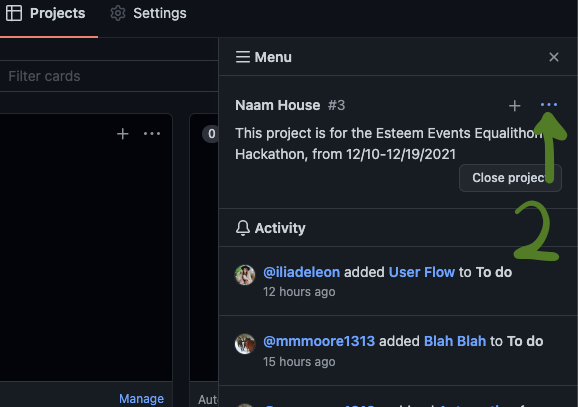
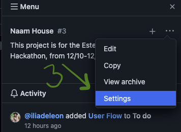
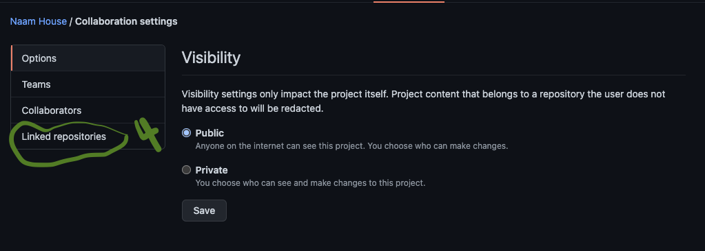
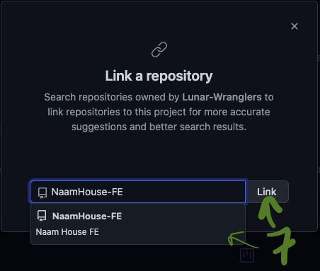

# From the Project Menu

On the main Project page:

1.  Click `Menu`

    ``.png>)``
2.  Click the `...`

    ````
3.  Click `Settings`

    ````
4.  Click `Linked repositories`

    ````
5.  Click `Link a repository`

    ``.png>)``
6.  Type in a repository name

    .png>)
7.  Choose the repository and click `Link`

    ````
