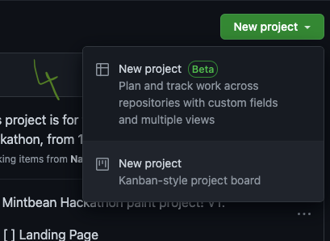
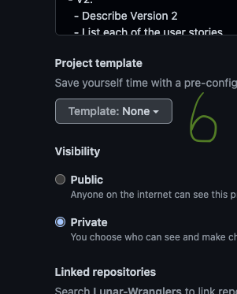

# Multi-repo Project

From your personal/organization `Overview` tab:

1.  Click the `Projects` tab

    
2.  Click the 2nd `Projects` option on the list to the left

    
3.  Click the `New project` button

    
4.  Choose the project board type. For our purposes, we're using the `Kanban-style project board`

    ````
5.  Give your board a name and description

    
6.  Click `Template`

    ````
7.  Choose a template from the dropdown; for our purposes, we're using the `Automated kanban` template

    
8.  Choose your `Visibility` (I prefer `Public` unless working on a paid project)

    
9.  Search for and link any repositories that are related to the project

    
10. Click `Create project`

    ````

[track-projects.md](track-projects.md "mention")
