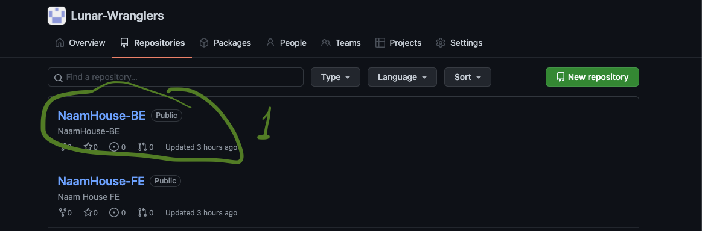
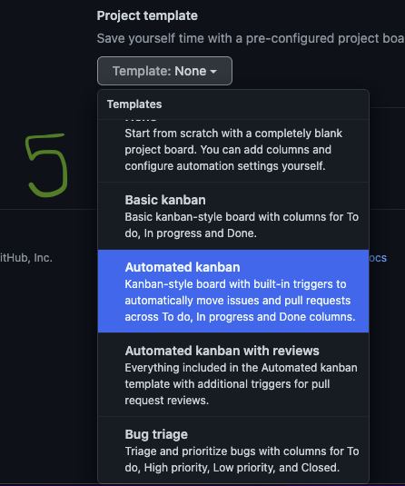
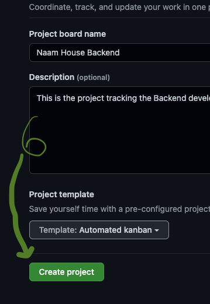

# Single-repo Project

From the `Repositories` tab:

1.  Choose a repo and click the repo name

    
2.  From the `Projects` tab, click `Create a project`

    ``.png>)``
3.  Give your Project board a name and a description. Best practices for descriptions will be addressed later

    .png>)
4.  Click `Template`

    ``.png>)``
5.  Choose the appropriate template from the dropdown. For our purposes, we'll use `Automated kanban`

    ````
6.  Click `Create Project`

    ````
