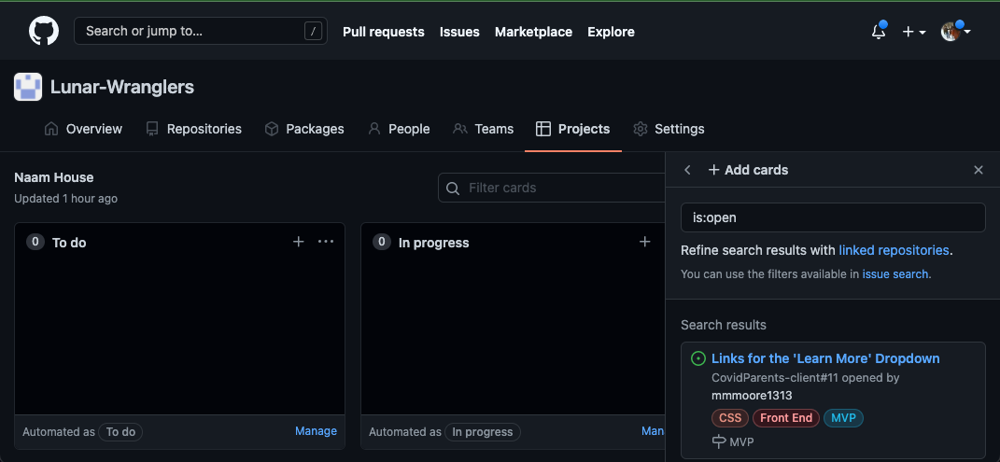

# Navigate to Existing Project

1. Go to your [GitHub](https://github.com) (you should already be signed in)
2.  Click on your icon in the top right corner\

    .png>)
3.  Click `Your Organizations`

    .png>)
4.  Click the organization of your choice (`Lunar-Wranglers` for our projects)

    .png>)
5.  Click `Projects`

    .png>)
6.  Click `Projects` with the bars and not cross

    .png>)
7.  Choose the project you wish to work on

    .png>)
8.  Voila

    
