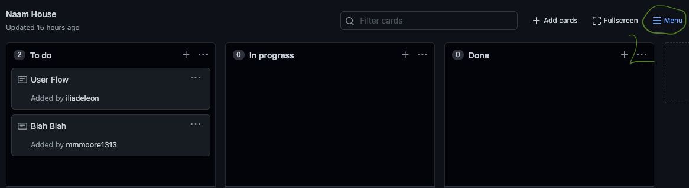
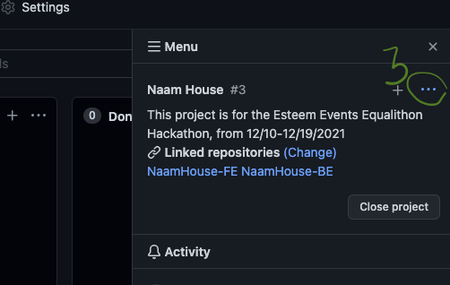
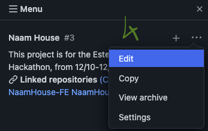
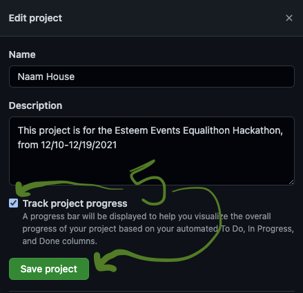

# Track Projects

From the specific project's main page:

1. Close the `Add cards` modal
2.  Click `Menu`

    ````
3.  Click `...`

    
4.  Click `Edit`

    ````
5.  Make sure `Track project progress` is checked and then click `Save project`

    ````
